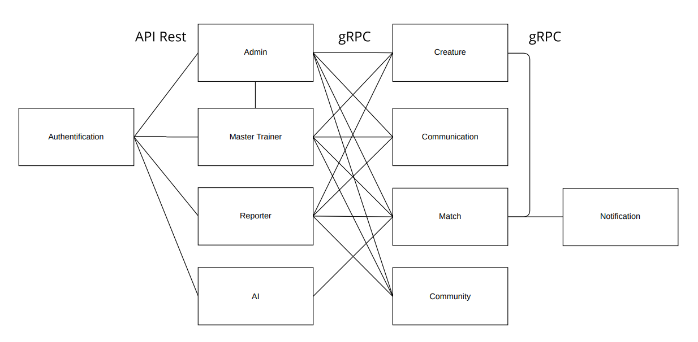

# Architecture des Microservices

## Authentification Service
- Gestion de compte:
  - Inscription/connexion
  - Connexion à la plateforme
  - Modification des informations

## Administrator Service (Réservé aux administrateurs)
- Permet la modification et la suppression des joueurs et des matchs.
- Permet le bannissement des joueurs.
- Fournit des statistiques de la plateforme.

## Reporter Service (Réservé aux Reporters)
- Permet d'extraire des statistiques de la plateforme.

## Master Trainer Service
- Gère les informations des joueurs (ex : nom, crédits, équipe, badges, etc.).
- Permet la modification des informations des joueurs.
- Gère les statistiques des joueurs.

## Creature Service
- Gestion de la composition d'une équipe d'un joueur
- Consultation, ajout, modification et suppression d'une créature dans le store.

## Communication Service
- Gestion des messages entre joueurs
- Gestion des invitations

## Community Service
- Gestion de la liste des joueurs
- Gère les matchs et les invitations.
- Fournit des informations communautaires (ex : les badges)

## Match Service
- Consulte, Crée, modifie et annule les matchs.
- Gère le déroulement des matchs, y compris les manches.
- Enregistre les résultats des matchs.

## Notification Service
- Envoie de notifications aux joueurs
